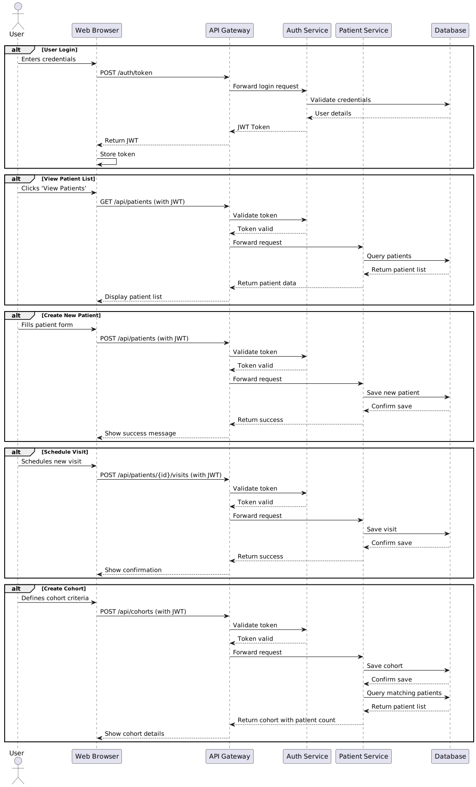

# Healthcare Patient Records Dashboard

A comprehensive healthcare management system for managing patient records, visits, and care coordination.

## System Architecture

The application follows a microservices architecture with the following services:

1. **API Gateway** - Central entry point for all client requests
2. **Auth Service** - Handles authentication and authorization
3. **Patient Service** - Manages patient records and visits
4. **Database** - PostgreSQL for data persistence





## Features

### Patient Management
- CRUD operations for patient records
- Advanced search and filtering
- Demographic information tracking
- Medical history management

### Visit Management
- Schedule and track patient visits
- Record diagnoses and treatments
- Track visit status (PENDING, COMPLETED, CANCELLED, NO_SHOW)
- Associate visits with specific doctors

### Cohort Management
- Create and manage patient cohorts based on custom criteria
- Filter patients by demographics, visit history, and medical conditions
- Save and reuse cohort definitions
- Track patients with pending visits

## Prerequisites

- Java 17 or higher
- Maven 3.6 or higher
- Docker and Docker Compose (for containerized deployment)
- PostgreSQL 13 or higher

## Quick Start with Docker

The easiest way to get started is using Docker Compose:

```bash
# Start all services
docker-compose up -d

# View logs
docker-compose logs -f

# Stop services
docker-compose down
```

## API Documentation

### Authentication

1. **Login**
   ```
   POST /auth/token
   ```
   Request body:
   ```json
   {
     "username": "admin",
     "password": "admin123"
   }
   ```
   
   Response:
   ```json
   {
     "token": "eyJhbGciOiJIUzI1NiIsInR5cCI6IkpXVCJ9..."
   }
   ```

   Include the token in subsequent requests in the `Authorization` header:
   ```
   Authorization: Bearer <token>
   ```

### Endpoints

#### Patients

- **Get All Patients**
  ```
  GET /api/patients
  ```
  Query Parameters:
  - `page`: Page number (default: 0)
  - `size`: Page size (default: 20)
  - `search`: Search term (filters by name, email, or phone)
  - `status`: Filter by status (ACTIVE, INACTIVE)
  - `sort`: Sort field and direction (e.g., `lastName,asc`)
  
  Example response:
  ```json
  {
    "content": [
      {
        "id": 1,
        "firstName": "John",
        "lastName": "Doe",
        "dateOfBirth": "1985-04-15",
        "gender": "MALE",
        "email": "john.doe@example.com",
        "phoneNumber": "+1234567890",
        "status": "ACTIVE"
      }
    ],
    "pageable": {
      "sort": {
        "sorted": true,
        "unsorted": false,
        "empty": false
      },
      "pageNumber": 0,
      "pageSize": 20,
      "offset": 0,
      "paged": true,
      "unpaged": false
    },
    "totalElements": 1,
    "totalPages": 1,
    "last": true,
    "size": 20,
    "number": 0,
    "sort": {
      "sorted": true,
      "unsorted": false,
      "empty": false
    },
    "numberOfElements": 1,
    "first": true,
    "empty": false
  }
  ```

- **Get Patient by ID**
  ```
  GET /patients/{id}
  ```

- **Create Patient**
  ```
  POST /patients
  ```
  Required fields: `firstName`, `lastName`, `dateOfBirth`, `gender`

- **Update Patient**
  ```
  PUT /patients/{id}
  ```

- **Delete Patient**
  ```
  DELETE /patients/{id}
  ```

#### Visits

- **Get All Visits for Patient**
  ```
  GET /api/patients/{patientId}/visits
  ```
  Query Parameters:
  - `status`: Filter by visit status (PENDING, COMPLETED, CANCELLED, NO_SHOW)
  - `fromDate`: Filter visits after this date (yyyy-MM-dd)
  - `toDate`: Filter visits before this date (yyyy-MM-dd)
  
  Example response:
  ```json
  [
    {
      "id": 1,
      "patientId": 1,
      "doctorId": 2,
      "visitDate": "2025-08-01T09:30:00",
      "status": "COMPLETED",
      "diagnosis": "Hypertension",
      "treatment": "Prescribed Lisinopril 10mg daily",
      "visitNotes": "Patient reports feeling better with current medication"
    }
  ]
  ```

- **Get Visit by ID**
  ```
  GET /api/patients/{patientId}/visits/{visitId}
  ```

- **Create Visit**
  ```
  POST /api/patients/{patientId}/visits
  ```
  Request body:
  ```json
  {
    "doctorId": 2,
    "visitDate": "2025-10-01T14:30:00",
    "status": "PENDING",
    "diagnosis": "Annual Checkup",
    "treatment": "Routine examination",
    "visitNotes": "Patient due for annual physical"
  }
  ```
  Required fields: `doctorId`, `visitDate`

- **Update Visit**
  ```
  PUT /api/patients/{patientId}/visits/{visitId}
  ```
  
- **Update Visit Status**
  ```
  PATCH /api/patients/{patientId}/visits/{visitId}/status
  ```
  Request body:
  ```json
  {
    "status": "COMPLETED",
    "notes": "Patient showed improvement"
  }
  ```

- **Delete Visit**
  ```
  DELETE /api/patients/{patientId}/visits/{visitId}
  ```

#### Cohorts

- **Get All Cohorts**
  ```
  GET /api/cohorts
  ```
  Query Parameters:
  - `page`: Page number (default: 0)
  - `size`: Page size (default: 20)
  - `search`: Search term to filter by name or description

- **Get Cohort by ID**
  ```
  GET /api/cohorts/{id}
  ```

- **Get Patients in Cohort**
  ```
  GET /api/cohorts/{id}/patients
  ```
  Applies the cohort's filter criteria and returns matching patients.

- **Create Cohort**
  ```
  POST /api/cohorts
  ```
  Request body:
  ```json
  {
    "name": "Hypertension Patients",
    "description": "Patients with high blood pressure",
    "cohortFilter": {
      "conditions": [
        {
          "field": "diagnosis",
          "operator": "EQUALS",
          "value": "Hypertension"
        }
      ],
      "sortBy": "lastName",
      "sortDirection": "ASC"
    }
  }
  ```

- **Update Cohort**
  ```
  PUT /api/cohorts/{id}
  ```

- **Delete Cohort**
  ```
  DELETE /api/cohorts/{id}
  ```

### Cohort Filter Criteria

Cohort filters support complex criteria for patient selection:

```json
{
  "conditions": [
    {
      "field": "age",
      "operator": "GREATER_THAN_OR_EQUAL",
      "value": 65
    },
    {
      "field": "hasPendingVisits",
      "operator": "EQUALS",
      "value": true
    },
    {
      "field": "lastVisitDate",
      "operator": "BETWEEN",
      "value": ["2025-01-01", "2025-12-31"]
    }
  ],
  "sortBy": "lastVisitDate",
  "sortDirection": "DESC"
}
```

Supported filter fields:
- Basic: `firstName`, `lastName`, `gender`, `dateOfBirth`, `status`
- Medical: `bloodType`, `conditions`, `allergies`
- Visit-based: `lastVisitDate`, `hasPendingVisits`, `visitCount`
- Custom: Any patient field can be used with appropriate operators

Supported operators:
- `EQUALS`, `NOT_EQUALS`
- `CONTAINS` (for text search)
- `GREATER_THAN`, `LESS_THAN`
- `GREATER_THAN_OR_EQUAL`, `LESS_THAN_OR_EQUAL`
- `BETWEEN` (for date ranges)
- `IN` (for multiple possible values)

## Development

### Testing

Run the tests using Maven:
```bash
# Run all tests
mvn test

# Run tests for a specific module
cd patient-service
mvn test
```

### Database Migrations

Database migrations are managed through SQL scripts in the `db_init` directory. To apply a new migration:

1. Create a new SQL file with the next sequential number (e.g., `007-new-feature.sql`)
2. Add your DDL/DML statements
3. Test the migration locally
4. Include the migration file in your pull request

### API Documentation

API documentation is available at:
- Swagger UI: `http://localhost:8080/swagger-ui.html`
- OpenAPI JSON: `http://localhost:8080/v3/api-docs`

## Deployment

The application can be deployed using Docker Compose or to a Kubernetes cluster.

### Docker Compose

1. Create a `.env` file with your configuration
2. Start the services:
   ```bash
   docker-compose up -d
   ```
3. Access the application at `http://localhost:8080`

### Configuration

All services support the following configuration options via environment variables:

| Variable | Description | Default        |
|----------|-------------|----------------|
| `SERVER_PORT` | Port to run the service on | 8080           |
| `SPRING_PROFILES_ACTIVE` | Active Spring profile | `docker`       |
| `SPRING_DATASOURCE_URL` | Database JDBC URL | localhost:5432 |
| `SPRING_DATASOURCE_USERNAME` | Database username | postgres       |
| `SPRING_DATASOURCE_PASSWORD` | Database password | postgres       |
| `JWT_SECRET` | Secret key for JWT token signing | -              |
| 
## Monitoring and Observability

The application includes comprehensive monitoring capabilities:

### Health Checks
- `GET /actuator/health` - Application health status
- `GET /actuator/health/liveness` - Liveness probe
- `GET /actuator/health/readiness` - Readiness probe

### Metrics
- `GET /actuator/metrics` - Application metrics (requires Prometheus)
- `GET /actuator/prometheus` - Prometheus metrics endpoint

### Distributed Tracing
- Integrated with Zipkin for distributed tracing
- Configure `SPRING_ZIPKIN_BASE_URL` to enable

## Logging

Logs are written to the console and can be collected by your logging infrastructure:
- JSON format for structured logging
- Correlation IDs for request tracing
- Log levels can be configured via environment variables

## Error Handling

The API returns standardized error responses:

```json
{
  "timestamp": "2025-03-15T10:30:45.123Z",
  "status": 404,
  "error": "Not Found",
  "message": "Patient not found with id: 999",
  "path": "/api/patients/999",
  "requestId": "550e8400-e29b-41d4-a716-446655440000",
  "errors": [
    {
      "code": "PATIENT_NOT_FOUND",
      "message": "No patient found with ID 999"
    }
  ]
}
```

Common error codes:
- `400`: Bad Request - Invalid input
- `401`: Unauthorized - Authentication required
- `403`: Forbidden - Insufficient permissions
- `404`: Not Found - Resource not found
- `409`: Conflict - Resource already exists
- `500`: Internal Server Error - Unexpected error

## Security

### Authentication
- JWT-based authentication
- Token expiration and refresh mechanisms
- Secure password hashing with BCrypt

### Authorization
Role-based access control with the following roles:
- `ROLE_ADMIN`: Full system access
- `ROLE_DOCTOR`: Manage patients, visits, and view cohorts
- `ROLE_NURSE`: View patients and manage visits
- `ROLE_STAFF`: Basic patient management

## Performance Considerations

- Database query optimization with indexes
- Connection pooling with HikariCP
- Pagination for large result sets
